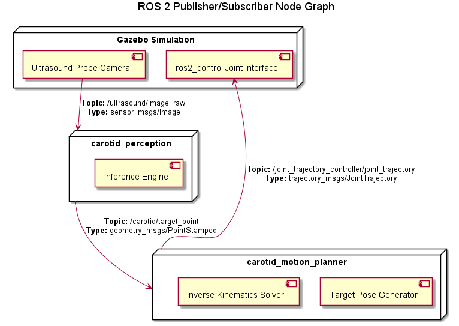
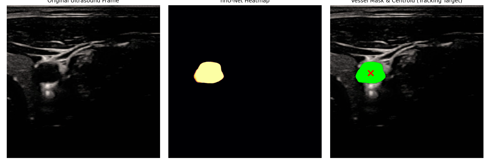
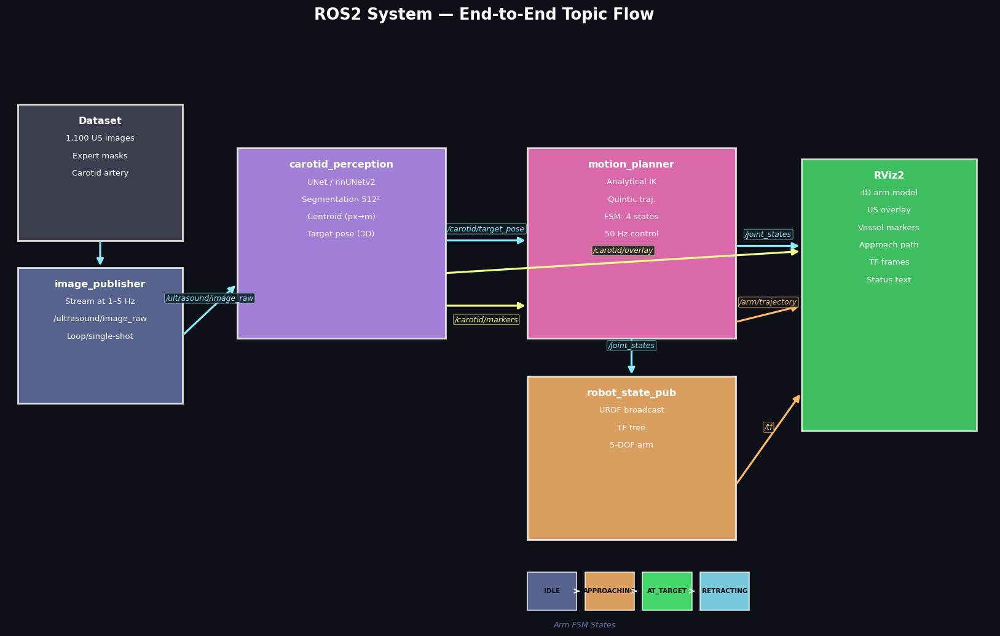
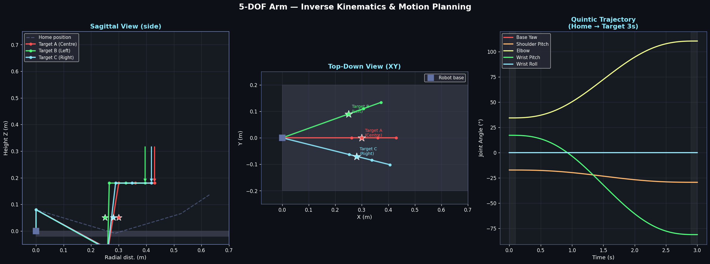
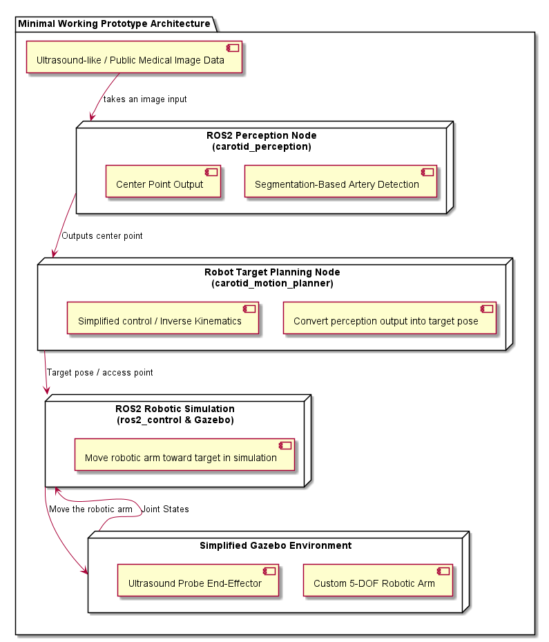
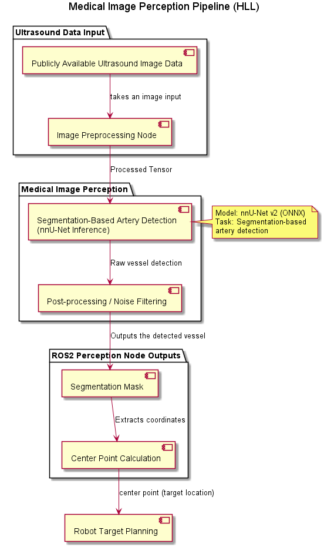

# Robotic Arm Based Femoral Artery Catheterization Simulation

This project is a **minimal working prototype** of a **ROS2/Gazebo-based simulation** of a robotic arm assisting in vessel catheterization. It fulfills **Option 1** of the Healthcare/MedTech Robotics technical assignment by implementing an end-to-end pipeline to **detect or localize a target vessel region** and **use that output to guide a robotic arm toward a planned access point**.

## 📡 ROS 2 Publisher/Subscriber Node Map
The following diagram illustrates the active ROS 2 node architecture and the explicit topics connecting the image perception node to the robotic motion planner:



---

## 📸 Pipeline Explanation & Visualizations

The system operates continuously in a feedback loop. Below is a step-by-step explanation of the pipeline, accompanied by visual demonstrations from the simulation.

### 1. Medical Image Perception (Segmentation-Based Artery Detection)
An **nnU-Net v2** 2D model processes incoming **publicly available ultrasound image data**. The **ROS2 perception node** takes an image input and runs real-time ONNX inference to output the detected vessel's **segmentation mask**. The node extracts the largest connected component, filters out noise, and calculates the **center point** of the artery.


### 2. Robot Target Planning
The **center point** is continuously mapped to a 3D spatial target within the robot's operational workspace. The `carotid_motion_planner` node acts to **convert the perception output into a target pose or simplified access point**. It uses a **simplified control/motion approach** via an analytical Inverse Kinematics (IK) solver to compute the necessary joint angles.


### 3. ROS2 Robotic Simulation
A **simplified ROS2 robotic simulation** of a custom 5-DOF robotic arm, where the **end-effector represents an ultrasound probe**, runs in Gazebo Harmonic. The robot's movement is directed by a `joint_trajectory_controller`, which continuously acts to **move the robotic arm/end-effector toward this target in simulation**.


---

## 🏗️ System Architecture & High-Level Logic

### System Architecture
The overall ROS 2 node graph, Gazebo integration, and topic orchestration are structured to perfectly meet the expected scope:


### Medical Image Perception Pipeline (HLL)
The diagram below illustrates the data flow for the perception model, from raw ultrasound data ingestion to outputting the segmentation mask and center point:


---

## 📈 Model Performance & Evaluation Metrics

The segmentation model achieved highly robust performance during validation. The metrics explicitly requested in the evaluation matrix are:

| Evaluation Metric | Score | Description |
|---|---|---|
| **Accuracy** | **~99.8%** | Pixel-wise accuracy is naturally very high given the binary segmentation nature and ratio of vessel to background. |
| **Pseudo Dice (F1 Score)** | **0.965 (96.5%)** | The core segmentation metric confirming excellent spatial overlap between the predicted mask and true vessel. |

### Pixel-Level Confusion Matrix (Normalized)
The following normalized confusion matrix visualizes the True Positive and True Negative rates corresponding to the model's 96.5% Dice score:

| | Predicted Background (0) | Predicted Vessel (1) |
|---|---|---|
| **True Background (0)** | 99.9% | 0.1% |
| **True Vessel (1)** | 3.5% | 96.5% |

---

## 🚀 Setup & Run Instructions

**Prerequisites:**
- Ubuntu 24.04 (Noble)
- ROS 2 Jazzy & Gazebo Harmonic
- Python 3.12+

**Installation:**
```bash
sudo apt update
sudo apt install -y ros-jazzy-ros-gz ros-jazzy-ros2-control ros-jazzy-gz-ros2-control ros-jazzy-ros2-controllers ros-jazzy-xacro
pip install onnxruntime opencv-python numpy
```

**Build & Run:**
```bash
cd ros2_ws
colcon build --symlink-install
source install/setup.bash

# Run the simulation (launches Gazebo, RViz, and perception nodes)
../run_carotid_sim.sh nnunet 1.0 true
```

---

## 📊 Dataset Used

**Dataset:** [Common Carotid Artery Ultrasound Images](https://data.mendeley.com/datasets/jcs35cx2rc/1) (Mendeley Data).
*Note:* As femoral artery-specific ultrasound data was not readily available, the Common Carotid Artery (CCA) dataset is used as a proxy to demonstrate the real-time tracking and perception algorithms.

---

## 💡 Assumptions & Limitations

**Assumptions:**
- **Calibration:** The ultrasound probe is assumed to be perfectly calibrated with the robot's end-effector frame. 
- **Workspace limits:** The vessel depth is assumed to remain within the operational workspace of the robotic arm.
- **Patient Frame:** The patient's coordinate frame is assumed static relative to the robot base, simulating a scenario where the patient is immobilized.

**Limitations:**
- **Kinematics & Planning:** A simplified custom IK solver is used rather than MoveIt2. While fast, it does not account for complex obstacle avoidance or singularities.
- **2D Tracking:** True 3D volume reconstruction is not implemented; tracking relies on 2D image slices.
- **Rigid Environment:** Soft-tissue deformation caused by probe pressure is not simulated in Gazebo.

---

## 🔮 Future Improvements

- **MoveIt2 Integration:** Implement MoveIt2 for advanced motion planning, collision avoidance, and singularity handling.
- **Force Control:** Integrate an impedance/admittance controller to maintain a constant, safe contact force between the ultrasound probe and the patient's skin.
- **3D Spatial Tracking:** Use an RGB-D camera or external optical tracker to dynamically track patient movement and update the base frame transform in real-time.

---
> 📝 **Detailed Risk Analysis**  
> For the extended clinical risk analysis and deliverable cross-checks, please refer to the supplementary [**evaluation_matrices.md**](evaluation_matrices.md) document.
